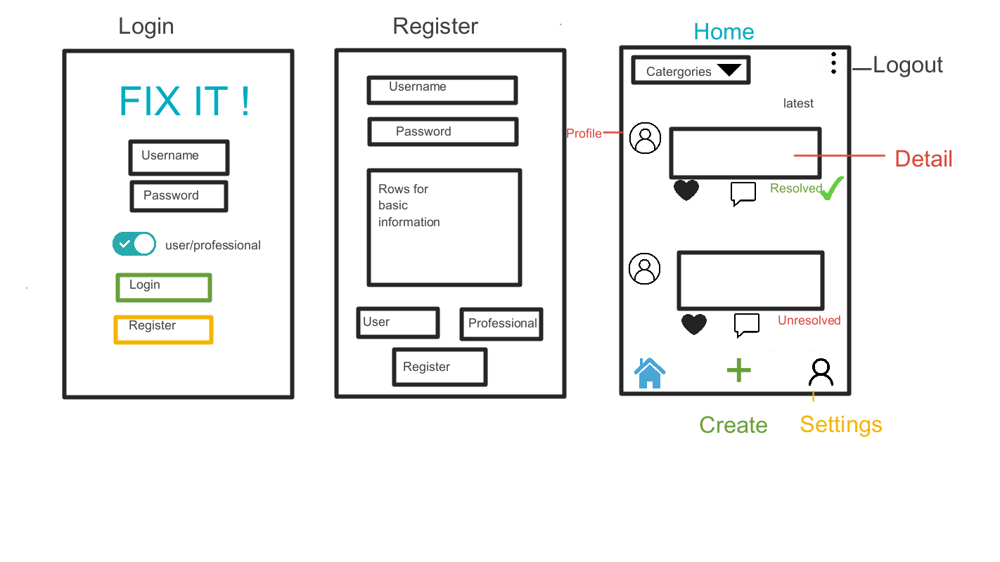
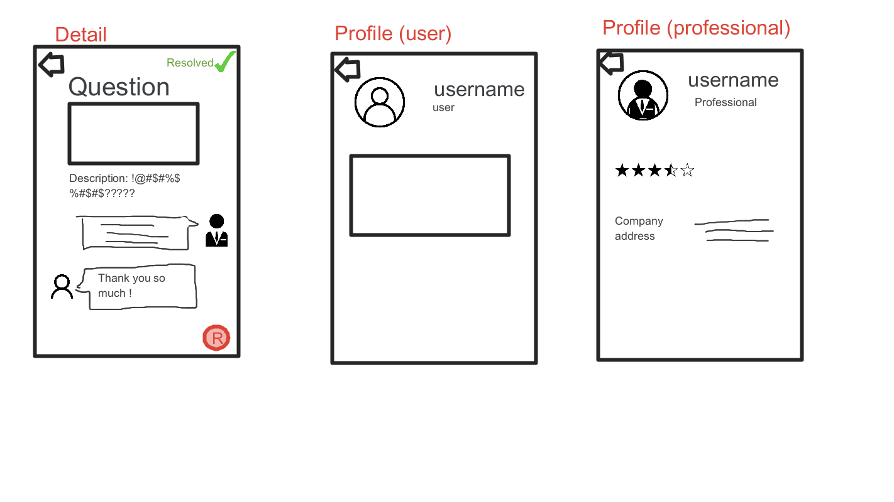
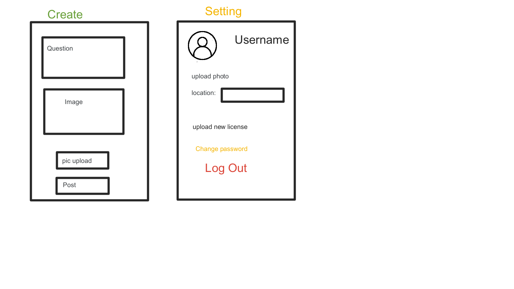
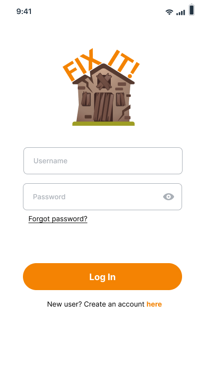
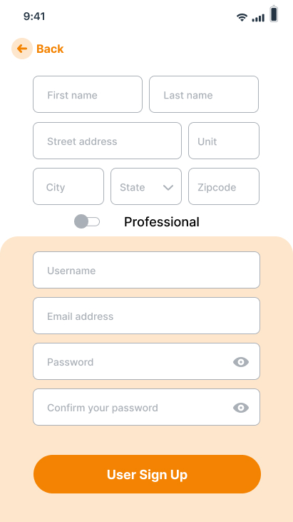
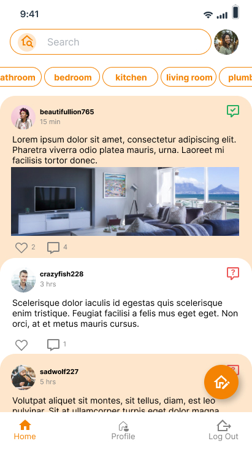
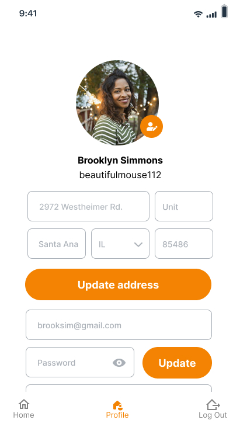
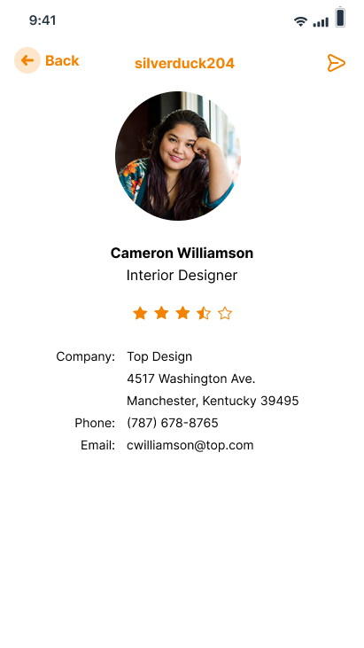
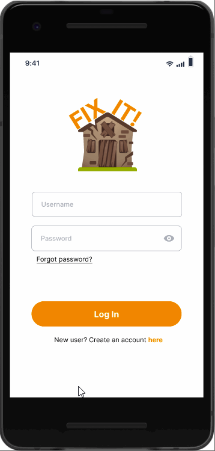

App Design Project
===

# FIX IT!


## Table of Contents
1. [Overview](#Overview)
1. [Product Spec](#Product-Spec)
1. [Wireframes](#Wireframes)
2. [Schema](#Schema)
3. [Sprint Progress](#Sprint-Progress)

## Overview
### Description
An app that gathers homeowners, renters, and professionals to discuss home projects with ways to repair or fixes. Users are able to find professionals in their local area.

### App Evaluation
- **Category:** Social Networking/Services
- **Mobile:** Mobile is a fast and easy way for customers and professionals to connect with their needs.
- **Story:** Creates a platform for demands in the form of home repairs/services which is not readily available in today’s world. By having a streamlined application that can both advertise and fulfill needs, people are more inclined to spread and utilize the application.
- **Market:** The clients can be anyone who owns or rents a home (mostly adults). The professionals are people who have licenses or certifications related to home/building.
- **Habit:** This app can be used at least once per year when cleaning up their home, when maintenance is needed or for remodeling projects. It can be used as often to ask questions, give suggestions, or to showcase their home projects. 
- **Scope:** Allow users to browse Q/A on home projects and allow professionals to advertise their services.


## Product Spec

### 1. User Stories (Required and Optional)

**Required Must-have Stories**

* Login
* Register
    - User/Professional
* Home (User)
    - Create posts
    - menu to categories
    - Respond to posts as 'user' tag
* Home (Professional)
    * menu to categories
    * Answer posts with 'professional' tag
    * Unable to create new posts 
* Profile (user)
    * Basic information of user 
* Profile (professional)
    * Verification of identity
    * Basic information and profession
* Detail
    * image (not required)
    * question
    * report functionality 


**Optional Nice-to-have Stories**
* Tips to pop up when open app
* Administration to monitor users and professionals
* Setting
    * Choose to show private information or not 
    * change password
* rating
* upload profile image
* reply to posts
* other users can DM other users
* Search posts
* Professionals can advertise
* Users can search for repair/fix based on their location

### 2. Screen Archetypes

* Login
    * user can log in
* Register
    - user can register for an account for User/Professional (bool), (professional) location
* Home (User)
    - Create posts
    - menu to categories
    - Respond to posts as 'user' tag
* Home (Professional)
    * menu to categories
    * Answer posts with 'professional' tag
    * Unable to create new posts 
* Profile (user)
    * Basic information of user 
* Profile (professional)
    * Verification of identity
    * Basic information and profession
* Detail
    * other user or professional can reply
    * image (not required)
    * question
    * report functionality 


### 3. Navigation
**Tab Navigation (top)** (Tab to Screen)
* Categories
* logout


**Tab Navigation (bottom)** (Tab to Screen)

* Detail
* Home
* Create
* Account

**Flow Navigation** (Screen to Screen)
* Login
    - Home
* Register
    - Login
* Home
    - Detail
* Setting
    * Login
* Account 
    * Home
* LogOut
    * Login


## Wireframes

 
 


### [BONUS] Digital Wireframes & Mockups
 



### [BONUS] Interactive Prototype


## Schema
### Models
#### User

   | Property      | Type     | Description |
   | ------------- | -------- | ------------|
   | objectId      | String   | unique id for the user account(default field) |
   | firstName     | String   | name of user |
   | lastName      | String   | name of user |
   | email         | String   | email of user |
   | username      | String   | alias of user |
   | password      | String   | password of user |
   | profileImage  | File     | user profile image |
   | createdAt     | DateTime | date when post is created (default field) |
   | updatedAt     | DateTime | date when post is last updated (default field) |

#### Professional

   | Property      | Type     | Description |
   | ------------- | -------- | ------------|
   | objectId      | String   | unique id for the user post (default field) |
   | user       | Pointer to User    | user model |
   | ratings | Number | rating of a professional |
   | title     | String   | job title of user |
   | company     | String   | company name of user |
   | street     | String   | work street address of user |
   | unit     | String   | unit for address of user |
   | city     | String   | city of company |
   | state     | String   | state of company |
   | zipcode | Number| zipcode of company |
   | phone   | Number| work phone number of user |
   | createdAt     | DateTime | date when post is created (default field) |
   | updatedAt     | DateTime | date when post is last updated (default field) |


#### Post

   | Property      | Type     | Description |
   | ------------- | -------- | ------------|
   | objectId      | String   | unique id for the user post (default field) |
   | author        | Pointer to User| image author |
   | image         | File     | image that user posts |
   | Question     | String   | user question |
   | commentsCount | Number   | number of comments that has been posted to an image |
   | likesCount    | Number   | number of likes for the post |
   | createdAt     | DateTime | date when post is created (default field) |
   | updatedAt     | DateTime | date when post is last updated (default field) |
   | solved     | Boolean | user can mark the post if it the question gets resolved |
   | category     | String | category of user's post |


### Networking
#### List of network requests by screen
   - Home Feed Screen
      - (Read/GET) Query all posts order by each Post CreatedAt
         ```java
         ParseQuery<Post> query = ParseQuery.getQuery(Post.class);
        query.setLimit(20);
        query.addDescendingOrder(Post.KEY_CREATED_KEY);
        query.include(Post.KEY_USER);
        query.findInBackground(new FindCallback<Post>() {
            @Override
            public void done(List<Post> posts, ParseException e) {
                if (e!=null){
                    Log.e(TAG, "issue with getting posts",e);
                    return;
                }
                for(Post post: posts){
                    Log.i(TAG, "Post"+post.getDescription()+" username: "+ post.getUser().getUsername());
                }
                adapter.clear();
                adapter.addAll(posts);
                fragmentPostsBinding.swiperContainer.setRefreshing(false);

                }
            });
        }
        ```
      - *(Create/POST) Create a new like on a post
      - *(Delete) Delete existing like
      - *(Create/POST) Create a new comment on a post
      - *(Delete) Delete existing comment
   - Create Post Screen
      - (Create/POST) Create a new post object
   - Profile Screen
      - (Read/GET) Query logged in user object
      - (Update/PUT) Update user profile image

## Sprint Progress
### Sprint 1
#### Items Completed
* Created framework
* Added default styles/color and icons
* Added Login and Data models
* Connected to Parse

#### Walkthrough 


### Sprint 2
#### Items Completed
* User profile
* Sign up with user and professional
* Added Log out

#### Walkthrough 


### Sprint 3

#### Items Completed
* User Detailed profile
* Cleaned up Compose and added disable/enable conditional 
* Updated and began comment section 

 


### Sprint 4
#### Items Completed
* Detail post with comments
* Detail post with clickable full image 

#### Walkthrough 
 
